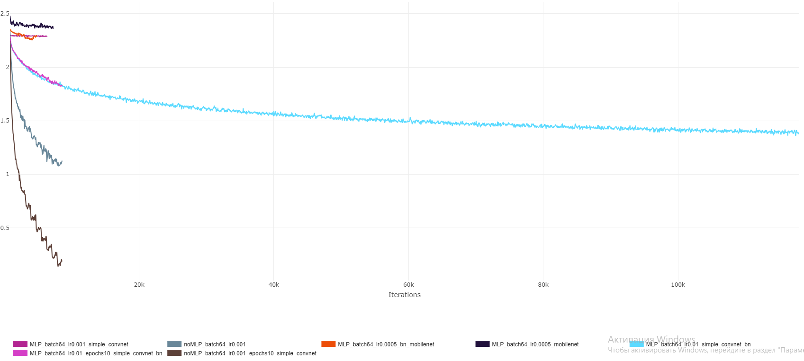
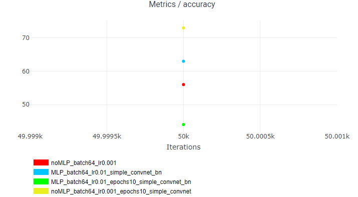

# MLP Parametrization

## Contents

`cifar_training.ipynb` notebook contains training of a simple convolutional net without parametrization.
`MLP_10_epochs.ipynb` notebook contains parametrization class and training with parametrization.

Several experiments have been conducted, including training of mobilenet_v2, changing learning rate, MLP architecture and lr scheduler.


## Requirements
```
numpy==1.22.4
torch==1.13.1+cu117
torchvision==0.14.1+cu117
tqdm==4.64.1
clearml==1.9.3
```
## Results

Experiments showed that parametrized models lose significantly in quality. Along with that, training parametrized models requires more recources and more precise change of hyperparameters. 

Running loss graph



Accuracy graph 

